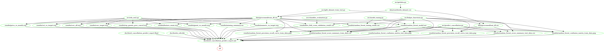

# DSCI-522_group-28

  - contributors: Jared Splinter, Chen Zhao, Debananda Sarkar, Peter Yang

Data analysis project for DSCI 522 (Data Science workflows); a
course in the Master of Data Science program at the University of
British Columbia.

## About

Here we attempt to build a classification model to predict whether a given hotel booking is likely to be canceled. A model was selected by comparing many classification algorithims and selecting the best one as the Random Forest classification algorithm. From there, hyperparameter optimization was performed and the best resulting model was selected. Our final model was scored using f1 metric on the test data and received a 0.835 compared to the train data f1 score of 0.983. The model incorrectly predicted 11.4% of the test bookings and suggests that the final model has been overfit. The model as it is may help hotels with their revenue management however we recommend continued improvement of the model and further feature examination/engineering to reduce overfitting and improve test score.

The data set used in this project comes from the Hotel Booking demand datasets from Antonio, Almeida and Nunes at Instituto Universitário de Lisboa (ISCTE-IUL), Lisbon, Portugal  (Antonio, Almeida, and Nunes 2019). The data was sourced directly from the Github Repository [here](https://github.com/rfordatascience/tidytuesday/tree/master/data/2020/2020-02-11). The dataset contains real world data obtained from two hotels; one resort hotel and one city hotel. Each row represents an individual hotel booking due to arrive between July 1st, 2015 and August 31st, 2017. There are 31 columns describing 40,060 observations from the resort hotel and 79,330 observations from the city hotel totaling 119,390 bookings.

## Reports

The EDA report can be found
[here](https://github.com/UBC-MDS/dsci-522_group-28/blob/main/doc/hotels_data_preliminary_analysis_eda.ipynb).

The final report can be found
[here](https://github.com/UBC-MDS/dsci-522_group-28/blob/main/doc/hotel_cancellation_predict_report.md).

## Usage

There are two recommended steps to replicate the analysis:

### 1. Using Docker

*note - the instructions in this section also depends on running this in a unix shell (e.g., terminal or Git Bash)*

1. Install [Docker](https://www.docker.com/get-started)
2. Clone this GitHub repository
3. Run the following command at the command line/terminal from the root directory of this project:

`docker run --rm -v /$(pwd):/home/dsci522_groupproject cz2020/dsci-522_group-28 make -C home/dsci522_groupproject all`

4. To reset the repo to a clean state, with no intermediate or results files, run the following command at the command line/terminal from the root directory of this project:

`docker run --rm -v /$(pwd):/home/dsci522_groupproject cz2020/dsci-522_group-28 make -C home/dsci522_groupproject clean`

### 2. Without using Docker

1. Clone this GitHub repository
2. Install the [dependencies](#dependencies) listed below
3. Open a terminal and navigate to project root directory
4. Run `make clean`
5. Run `make all`

*Please note that* 
- *the model evaluation process and hyperparameter tuning takes approximately 40 minutes and 2 hours respectively*
- *this is a resource intensive process and may take up most of the system resources during runtime*
- *As part of future enhancement, we will try to evaluate XGBoost and LightGBM Classification algorithms as they tend to run faster than Random Forest. If the results are suitable, we will do hyperparameter tuning on one of them instead of Random Forest*

## Dependencies

  - Python 3.8.5 and Python packages:
      - numpy=1.19.2
      - pandas=1.1.3
      - matplotlib=3.3.2
      - sklearn=0.23.2
      - altair=4.1.0
      - altair_saver=0.5.0
      - docopt=0.6.2
      - pickle=4.0
  - R 4.0.3 and R packages:
      - tidyverse==1.3.0
      - knitr=1.30
      - kableExtra==1.3.1
  - GNU make 4.3

## Makefile Dependency Diagram

## License

The Hotel Booking demand dataset is an open access article distributed under the terms of the Creative Commons CC-BY license, which permits unrestricted use, distribution, and reproduction in any medium, provided the original work is properly cited.  If re-using/re-mixing please provide attribution and link to this webpage.

# References

Antonio, Nuno, Ana de Almeida, and Luis Nunes. 2019. "Hotel booking demand datasets." Data in brief 22: 41-49. <https://doi.org/10.1016/j.dib.2018.11.126>

