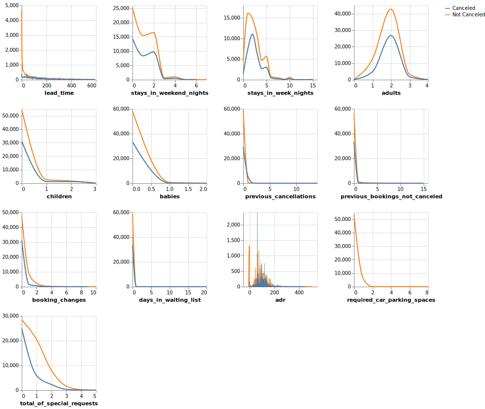
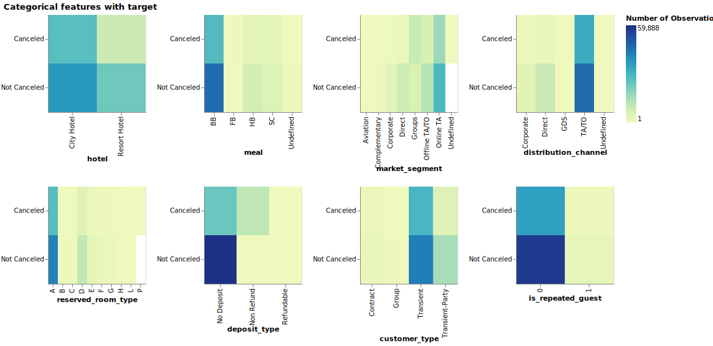

Hotel Cancellation Predict Report
================
Jared Splinter
11/27/2020

  - [Predicting Hotel Booking Cancellation from Real World Hotel
    Bookings](#predicting-hotel-booking-cancellation-from-real-world-hotel-bookings)
  - [Summary](#summary)
  - [Introduction](#introduction)
  - [Methods](#methods)
      - [Data](#data)
      - [Analysis](#analysis)
  - [Results & Discussion](#results-discussion)
      - [Exploratory Data Analysis](#exploratory-data-analysis)
      - [Model Results](#model-results)
  - [References](#references)

# Predicting Hotel Booking Cancellation from Real World Hotel Bookings

Jared Splinter,

Created: 11/27/2020

# Summary

# Introduction

The hospitality industry and hotels in particular suffer huge revenue
losses due to booking cancellations and no shows. The revenue lost
becomes a sunk cost when there is not enough time to book the room again
before the date of stay (Xie and Gerstner 2007). Hotels would like to
get an estimate if a booking is likely to be cancelled as predicting
cancellations is useful for a hotel’s revenue management.

Here we ask if we can use a machine learning algorithm to predict
whether a given hotel booking is likely to be canceled. Finding the
conditions on which a booking is likely to be canceled can help a hotel
improve the conditions and limit the number of cancellations they
receive, thereby increasing their revenue. If a booking is likely to be
canceled a hotel may also wish to implement higher cancellation fees to
make up some of the lost revenue (Chen, Schwartz, and Vargas 2011). If a
machine learning algothrithm can accurately predict if a hotel booking
will be canceled it could help hotels make up some of their lost revenue
and potentially find ways in which to improve customer satisfaction.

# Methods

## Data

The data set used in this project comes from the Hotel Booking demand
datasets from Antonio, Almeida and Nunes at Instituto Universitário de
Lisboa (ISCTE-IUL), Lisbon, Portugal (Antonio, Almeida, and Nunes 2019).
The data was sourced directly from the Github Repository
[here](https://github.com/rfordatascience/tidytuesday/tree/master/data/2020/2020-02-11).
The dataset contains real world data obtained from two hotels; one
resort hotel and one city hotel. Each row represents an individual hotel
booking due to arrive between July 1st, 2015 and August 31st, 2017.
There are 31 columns describing 40,060 observations from the resort
hotel and 79,330 observations from the city hotel totaling 119,390
bookings.

## Analysis

Many classification model algorithms were compared using
cross-validation so the best classification model could be selected. 5
fold cross validation was selected as the data set is quite large and it
was scored on f1, precision, recall and accuracy as there is class
imbalance within the dataset. f1 scores are reported as it is a good
balance between recall and precision scores. The classification models
compared are: Dummy Classifier, Decision Tree, K-nearest neighbor, SVC
with RBF kernel, Logistic Regression, and Random Forest.

From there, Random Forest was chosen as the classification model and
hyperparameter optimization was carried out using Random Search
Cross-Validation. The hyperparameters optimized from Random Forest were
`n_estimators` and `min_sample_split`. The best model from the Random
Search Cross-validation was selected and used to fit on the train data
and then to score on the test data. 4 features were dropped from the
analysis: company, agent, reservation\_status, and
reservation\_status\_date.

The Python programming language (Van Rossum and Drake 2009) and the
following Python packages were used to perform the analysis: docopt
(Keleshev 2014), pandas (McKinney 2010; team 2020), sklearn (Pedregosa
et al. 2011), altair (VanderPlas et al. 2018), numpy (Harris et al.
2020). The code used to perform the analysis and create this report can
be found here: <https://github.com/UBC-MDS/dsci-522_group-28>

# Results & Discussion

### Exploratory Data Analysis

In our investigation of the dataset we sought to understand which
features might be useful for prediction. Reading about the data
collected we immediately decided that the columns `reservation_status`
and `reservation_status_date` should be omitted from the model as they
contain information after the prediction target and thus would not be
useful. After establishing that there was a class imbalance between we
checked to see if the dataset was “complete” (ie. if the dataset was
missing values). The results of the missing values are presented in
Table 1.

<table class="table" style="width: auto !important; margin-left: auto; margin-right: auto;">

<caption>

Table 1. Predictors with missing values, number of values missing and
percentage of values missing

</caption>

<thead>

<tr>

<th style="text-align:right;">

X1

</th>

<th style="text-align:left;">

feature

</th>

<th style="text-align:right;">

missing\_count

</th>

<th style="text-align:right;">

missing\_percentage

</th>

</tr>

</thead>

<tbody>

<tr>

<td style="text-align:right;">

10

</td>

<td style="text-align:left;">

children

</td>

<td style="text-align:right;">

3

</td>

<td style="text-align:right;">

0.00

</td>

</tr>

<tr>

<td style="text-align:right;">

13

</td>

<td style="text-align:left;">

country

</td>

<td style="text-align:right;">

385

</td>

<td style="text-align:right;">

0.40

</td>

</tr>

<tr>

<td style="text-align:right;">

23

</td>

<td style="text-align:left;">

agent

</td>

<td style="text-align:right;">

12966

</td>

<td style="text-align:right;">

13.58

</td>

</tr>

<tr>

<td style="text-align:right;">

24

</td>

<td style="text-align:left;">

company

</td>

<td style="text-align:right;">

90133

</td>

<td style="text-align:right;">

94.37

</td>

</tr>

</tbody>

</table>

As 94.37% of the values from `company` are missing we decided to also
exclude this from the model. Finally, we also decided to omit `agent`
from the model **MORE ON REASONING**

Having chosen our predictors, we then plotted the distributions of the
numeric features and separated classes by colour (blue for canceled,
orange for not canceled). Many of the distributions are right skewed as
they are dominated by 0 values. This may mean many of these numeric
features may not be good predictors of the targets. A few numeric
features that looked promising for prediction are
`total_of_special_requests`, `required_car_parking_spaces`,
`stay_in_week_nights` and `stay_in_weekend_nights` as they have wider
distributions. The results for the numeric feature distributions are
presented in Figure 1.

Figure 1. Comparison of the numeric distributions of training data
predictors between canceled and not canceled bookings.

We then decided to look at the categorical features of the dataset to
visualize the differences between classes. To do this, we plotted a 2D
heatmap of every categorical variable counting the number of
observations for each. A categorical feature with visible differences in
the heatmap between canceled and not canceled could be good predictors
for the model. We find that in particular, `hotel`, `market_segment`,
`reserved_room_type` and `customer_type` could be viable useful
predictors. The results for the categorical heatmaps are presented in
Figure 2.

Figure 2. Comparison of the categorical features of training data
predictors between canceled and not canceled bookings.

### Model Results

We compared a few classification model algorithms using a 5 fold
cross-validation. Models were scored on the f1 metric. The results of
the cross-validation scores are presented in Table 2. Compared to the
baseline Dummy Classifier all models scored much higher. Random Forest
scored the highest validation f1 score followed by Decision Tree.
However, the fit time of Random Forest was much longer than that of
Decision Tree.

<table class="table" style="width: auto !important; margin-left: auto; margin-right: auto;">

<caption>

Table 2. 5 fold Cross validation scores of classifier models

</caption>

<thead>

<tr>

<th style="text-align:left;">

classifier\_name

</th>

<th style="text-align:right;">

fit\_time

</th>

<th style="text-align:right;">

score\_time

</th>

<th style="text-align:right;">

validation\_f1

</th>

<th style="text-align:right;">

train\_f1

</th>

</tr>

</thead>

<tbody>

<tr>

<td style="text-align:left;">

Dummy Classifier

</td>

<td style="text-align:right;">

0.0193955

</td>

<td style="text-align:right;">

0.0223241

</td>

<td style="text-align:right;">

0.3706303

</td>

<td style="text-align:right;">

0.3720946

</td>

</tr>

<tr>

<td style="text-align:left;">

Decision Tree

</td>

<td style="text-align:right;">

19.0155343

</td>

<td style="text-align:right;">

0.0980628

</td>

<td style="text-align:right;">

0.7940997

</td>

<td style="text-align:right;">

0.9945951

</td>

</tr>

<tr>

<td style="text-align:left;">

k\_Nearest\_Neighbor

</td>

<td style="text-align:right;">

17.4371542

</td>

<td style="text-align:right;">

194.6145562

</td>

<td style="text-align:right;">

0.7645612

</td>

<td style="text-align:right;">

0.8772294

</td>

</tr>

<tr>

<td style="text-align:left;">

SVC (RBF kernel)

</td>

<td style="text-align:right;">

506.2891913

</td>

<td style="text-align:right;">

61.0231221

</td>

<td style="text-align:right;">

0.7905805

</td>

<td style="text-align:right;">

0.8047185

</td>

</tr>

<tr>

<td style="text-align:left;">

Logistic Regression

</td>

<td style="text-align:right;">

14.0690587

</td>

<td style="text-align:right;">

0.0916533

</td>

<td style="text-align:right;">

0.7207729

</td>

<td style="text-align:right;">

0.7226086

</td>

</tr>

<tr>

<td style="text-align:left;">

Random Forest

</td>

<td style="text-align:right;">

129.4666012

</td>

<td style="text-align:right;">

0.7805111

</td>

<td style="text-align:right;">

0.8344283

</td>

<td style="text-align:right;">

0.9945771

</td>

</tr>

</tbody>

</table>

As Random Forest classifier scored the highest f1 validation score we
decided to use it as our classification model for the dataset. The next
step we took was to run hyperparameter optimization on the model.

# References

Antonio, Nuno, Ana de Almeida, and Luis Nunes. 2019. “Hotel Booking
Demand Datasets.” *Data in Brief* 22: 41–49.

Chen, Chih-Chien, Zvi Schwartz, and Patrick Vargas. 2011. “The Search
for the Best Deal: How Hotel Cancellation Policies Affect the Search and
Booking Decisions of Deal-Seeking Customers.” *International Journal of
Hospitality Management* 30 (1): 129–35.

Harris, Charles R., K. Jarrod Millman, St’efan J. van der Walt, Ralf
Gommers, Pauli Virtanen, David Cournapeau, Eric Wieser, et al. 2020.
“Array Programming with NumPy.” *Nature* 585 (7825): 357–62.
<https://doi.org/10.1038/s41586-020-2649-2>.

Keleshev, Vladimir. 2014. *Docopt: Command-Line Interface Description
Language*. <https://github.com/docopt/docopt>.

McKinney. 2010. “Data Structures for Statistical Computing in Python.”
In *Proceedings of the 9th Python in Science Conference*, edited by
Stéfan van der Walt and Jarrod Millman, 56–61.
[https://doi.org/ 10.25080/Majora-92bf1922-00a](https://doi.org/%2010.25080/Majora-92bf1922-00a%20).

Pedregosa, F., G. Varoquaux, A. Gramfort, V. Michel, B. Thirion, O.
Grisel, M. Blondel, et al. 2011. “Scikit-Learn: Machine Learning in
Python.” *Journal of Machine Learning Research* 12: 2825–30.

team, The pandas development. 2020. *Pandas-Dev/Pandas: Pandas* (version
latest). Zenodo. <https://doi.org/10.5281/zenodo.3509134>.

VanderPlas, Jacob, Brian Granger, Jeffrey Heer, Dominik Moritz, Kanit
Wongsuphasawat, Arvind Satyanarayan, Eitan Lees, Ilia Timofeev, Ben
Welsh, and Scott Sievert. 2018. “Altair: Interactive Statistical
Visualizations for Python.” *Journal of Open Source Software* 3 (32):
1057.

Van Rossum, Guido, and Fred L. Drake. 2009. *Python 3 Reference Manual*.
Scotts Valley, CA: CreateSpace.

Xie, Jinhong, and Eitan Gerstner. 2007. “Service Escape: Profiting from
Customer Cancellations.” *Marketing Science* 26 (1): 18–30.

