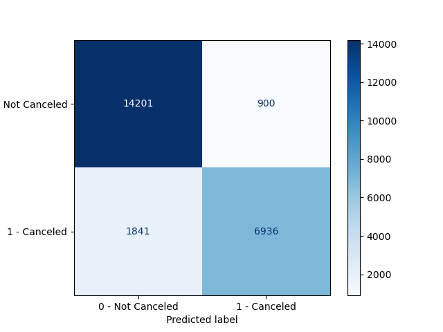
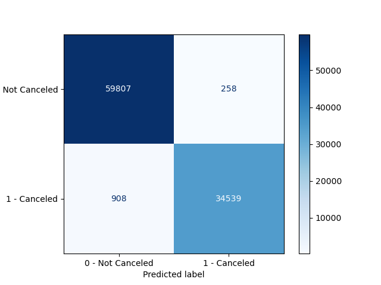

Hotel Cancellation Predict Report
================
Jared Splinter
11/27/2020

  - [Predicting Hotel Booking Cancellation from Real World Hotel
    Bookings](#predicting-hotel-booking-cancellation-from-real-world-hotel-bookings)
  - [Summary](#summary)
  - [Introduction](#introduction)
  - [Methods](#methods)
      - [Data](#data)
      - [Analysis](#analysis)
  - [Results & Discussion](#results-discussion)
      - [Exploratory Data Analysis](#exploratory-data-analysis)
      - [Model Results](#model-results)
      - [Future Improvements](#future-improvements)
  - [References](#references)

# Predicting Hotel Booking Cancellation from Real World Hotel Bookings

author: Jared Splinter

contributors: Chen Zhao, Debananda Sarkar, Peter Yang

Created: 11/27/2020

# Summary

Here we attempt to build a classification model to predict whether a
given hotel booking is likely to be canceled. A model was selected by
comparing many classification algorithims and selecting the best one as
the Random Forest classification algorithm. From there, hyperparameter
optimization was performed and the best resulting model was selected.
Our final model was scored using f1 metric on the test data and received
a 0.835 compared to the train data f1 score of 0.983. The model
incorrectly predicted 11.4% of the test bookings and suggests that the
final model has been overfit. The model as it is may help hotels with
their revenue management however we recommend continued improvement of
the model and further feature examination/engineering to reduce
overfitting and improve test score.

# Introduction

The hospitality industry and hotels in particular suffer huge revenue
losses due to booking cancellations and no shows. The revenue lost
becomes a sunk cost when there is not enough time to book the room again
before the date of stay (Xie and Gerstner 2007). Hotels would like to
get an estimate if a booking is likely to be cancelled as predicting
cancellations is useful for a hotel’s revenue management.

Here we ask if we can use a machine learning algorithm to predict
whether a given hotel booking is likely to be canceled. Finding the
conditions on which a booking is likely to be canceled can help a hotel
improve the conditions and limit the number of cancellations they
receive, thereby increasing their revenue. If a booking is likely to be
canceled a hotel may also wish to implement higher cancellation fees to
make up some of the lost revenue (Chen, Schwartz, and Vargas 2011). If a
machine learning algothrithm can accurately predict if a hotel booking
will be canceled it could help hotels make up some of their lost revenue
and potentially find ways in which to improve customer satisfaction.

# Methods

## Data

The data set used in this project comes from the Hotel Booking demand
datasets from Antonio, Almeida and Nunes at Instituto Universitário de
Lisboa (ISCTE-IUL), Lisbon, Portugal (Antonio, Almeida, and Nunes 2019).
The data was sourced directly from the Github Repository
[here](https://github.com/rfordatascience/tidytuesday/tree/master/data/2020/2020-02-11).
The dataset contains real world data obtained from two hotels; one
resort hotel and one city hotel. Each row represents an individual hotel
booking due to arrive between July 1st, 2015 and August 31st, 2017.
There are 31 columns describing 40,060 observations from the resort
hotel and 79,330 observations from the city hotel totaling 119,390
bookings.

## Analysis

Many classification model algorithms were compared using
cross-validation so the best classification model could be selected. 5
fold cross validation was selected as the data set is quite large and it
was scored on f1, precision, recall and accuracy as there is class
imbalance within the dataset. f1 scores are reported as it is a good
balance between recall and precision scores. The classification models
compared are: Dummy Classifier, Decision Tree, K-nearest neighbor, SVC
with RBF kernel, Logistic Regression, and Random Forest.

From there, Random Forest was chosen as the classification model and
hyperparameter optimization was carried out using Random Search
Cross-Validation. The hyperparameters optimized from Random Forest were
`n_estimators` and `min_sample_split`. The best model from the Random
Search Cross-validation was selected and used to fit on the train data
and then to score on the test data. 4 features were dropped from the
analysis: company, agent, reservation\_status, and
reservation\_status\_date.

The Python programming language (Van Rossum and Drake 2009) and the
following Python packages were used to perform the analysis: docopt
(Keleshev 2014), pandas (McKinney 2010; team 2020), sklearn (Pedregosa
et al. 2011), altair (VanderPlas et al. 2018), numpy (Harris et al.
2020). The code used to perform the analysis and create this report can
be found here: <https://github.com/UBC-MDS/dsci-522_group-28>

This report was created using the R programming language (R Core Team
2020) and the following R packages: knitr (Xie 2014), KableExtra (Zhu
2020), tidyverse (Wickham et al. 2019).

# Results & Discussion

### Exploratory Data Analysis

In our investigation of the dataset we sought to understand which
features might be useful for prediction. Reading about the data
collected we immediately decided that the columns `reservation_status`
and `reservation_status_date` should be omitted from the model as they
contain information after the prediction target and thus would not be
useful. After establishing that there was a class imbalance between we
checked to see if the dataset was “complete” (ie. if the dataset was
missing values). The results of the missing values are presented in
Table 1.

<table class="table" style="width: auto !important; margin-left: auto; margin-right: auto;">

<caption>

Table 1. Predictors with missing values, number of values missing and
percentage of values missing

</caption>

<thead>

<tr>

<th style="text-align:left;">

feature

</th>

<th style="text-align:right;">

missing\_count

</th>

<th style="text-align:right;">

missing\_percentage

</th>

</tr>

</thead>

<tbody>

<tr>

<td style="text-align:left;">

children

</td>

<td style="text-align:right;">

3

</td>

<td style="text-align:right;">

0.00

</td>

</tr>

<tr>

<td style="text-align:left;">

country

</td>

<td style="text-align:right;">

385

</td>

<td style="text-align:right;">

0.40

</td>

</tr>

<tr>

<td style="text-align:left;">

agent

</td>

<td style="text-align:right;">

12966

</td>

<td style="text-align:right;">

13.58

</td>

</tr>

<tr>

<td style="text-align:left;">

company

</td>

<td style="text-align:right;">

90133

</td>

<td style="text-align:right;">

94.37

</td>

</tr>

</tbody>

</table>

As 94.37% of the values from `company` are missing we decided to also
exclude this from the model. Finally, we also decided to omit `agent`
from the model as we determined there was not enough information about
the predictor. As we see in Table 1, almost 14% of training data does
not have a value for `agent`. The predictor is assigned a numeric value
but we are not sure how the id’s are assigned or specific per hotel. We
also observed that 115 out of 324 `agent` ids have less than 10
observations and 247 out of 324 `agent` ids have less than 100
observations. We also observe that 2 ids have over 10,000 observations
corresponding to specific hotels suggesting a correlation however, we
did not think for these reasons `agent` would be a good predictor.

Having chosen our predictors, we then plotted the densities of the
numeric features and separated classes by colour (blue for canceled,
orange for not canceled). Many of the densities are right skewed as they
are dominated by 0 values. This may mean many of these numeric features
may not be good predictors of the targets. A few numeric features that
looked promising for prediction are `total_of_special_requests`,
`required_car_parking_spaces`, `stay_in_week_nights` and
`stay_in_weekend_nights` as they have wider distributions. The results
for the numeric feature densities are presented in Figure 1.

Figure 1. Comparision of numeric densities of training data predictors
between canceled and not canceled bookings.

We then decided to look at the categorical features of the dataset to
visualize the differences between classes. To do this, we plotted a 1D
heatmap of every categorical variable showing the cancel rate for each.
A categorical feature with visible differences in the heatmap between
low and high cancel could be good predictors for the model. We find that
in particular, `hotel`, `market_segment`, `reserved_room_type`,
`distribution_channel` and `deposit_type` could be viable useful
predictors. The results for the categorical heatmaps are presented in
Figure 2.

Figure 2. Cancel rate of the categorical features of training data
predictors. Categories that are more blue have more bookings that have
been canceled.

In total, we dropped 4 predictors; `agent`, `company`,
`reservation_status` and `reservation_status_date` for reasons mentioned
above. All other predictors were included in the model, at the time of
making this model we did not know how to perform feature selection, in
future improvements of this work we would re-create the model with
feature selection and feature importance in mind to look for improvement
in model testing.

### Model Results

We compared a few classification model algorithms using a 5 fold
cross-validation. Models were scored on the f1 metric. All models were
evaluated with default hyperparameters where possible and the same
random state to replicate results. Exceptions to the default
hyperparameters include the k-Nearest Neighbor classifier had a
`n_neighbors` hyperparameter set at 3, and Logistic Regression
classifier had a max iteration set to 1000. The results of the
cross-validation scores are presented in Table 2. Compared to the
baseline Dummy Classifier all models scored much higher. Random Forest
scored the highest validation f1 score followed by Decision Tree.
However, the fit time of Random Forest was much longer than that of
Decision Tree.

<table class="table" style="width: auto !important; margin-left: auto; margin-right: auto;">

<caption>

Table 2. 5 fold Cross validation scores of classifier models

</caption>

<thead>

<tr>

<th style="text-align:left;">

Classifer Name

</th>

<th style="text-align:right;">

Fit Time

</th>

<th style="text-align:right;">

Score Time

</th>

<th style="text-align:right;">

Validation f1

</th>

<th style="text-align:right;">

Train f1

</th>

</tr>

</thead>

<tbody>

<tr>

<td style="text-align:left;">

Dummy Classifier

</td>

<td style="text-align:right;">

0.0173055

</td>

<td style="text-align:right;">

0.0230441

</td>

<td style="text-align:right;">

0.3706303

</td>

<td style="text-align:right;">

0.3720946

</td>

</tr>

<tr>

<td style="text-align:left;">

Decision Tree

</td>

<td style="text-align:right;">

17.2294734

</td>

<td style="text-align:right;">

0.0901294

</td>

<td style="text-align:right;">

0.7940997

</td>

<td style="text-align:right;">

0.9945951

</td>

</tr>

<tr>

<td style="text-align:left;">

k\_Nearest\_Neighbor

</td>

<td style="text-align:right;">

13.7782258

</td>

<td style="text-align:right;">

197.5482479

</td>

<td style="text-align:right;">

0.7645612

</td>

<td style="text-align:right;">

0.8772294

</td>

</tr>

<tr>

<td style="text-align:left;">

SVC (RBF kernel)

</td>

<td style="text-align:right;">

533.7971420

</td>

<td style="text-align:right;">

57.3568261

</td>

<td style="text-align:right;">

0.7905805

</td>

<td style="text-align:right;">

0.8047185

</td>

</tr>

<tr>

<td style="text-align:left;">

Logistic Regression

</td>

<td style="text-align:right;">

15.3228344

</td>

<td style="text-align:right;">

0.1147711

</td>

<td style="text-align:right;">

0.7207729

</td>

<td style="text-align:right;">

0.7226086

</td>

</tr>

<tr>

<td style="text-align:left;">

Random Forest

</td>

<td style="text-align:right;">

144.2220199

</td>

<td style="text-align:right;">

0.8293702

</td>

<td style="text-align:right;">

0.8344283

</td>

<td style="text-align:right;">

0.9945771

</td>

</tr>

</tbody>

</table>

As Random Forest classifier scored the highest f1 validation score we
decided to use it as our classification model for the dataset. The next
step we took was to run hyperparameter optimization on the model. We
chose to perform hyperparameter tuning for only the best performing
classifier model due to time constraints. The hyperparameters optimized
from Random Forest were `n_estimators` and `min_sample_split`. There are
many possible hyperparameters available for Random Forest Classifier
from sklearn, however in the interest of time we chose these 2
hyperparameters to optimize. `n_estimators` was chosen as it choses the
number of trees to be evaluated and we searched between values of 500
and 1000. `min_samples_split` works in conjunction as the minimum number
of observations required for a split in a tree values were chosen
between 4 and 11 to avoid overfitting.

The best model from hyperparameter optimization had hyperparameters of
`n_estimators = 700` and `min_sample_split = 4` as seen in Table 3.
Table 3 only includes the top 4 results of the hyperparameter
optimization to show comparision with other searches. The differences in
mean test score is very little between the top 3 results indicating the
hyperparameters may not change the models drastically.

<table class="table" style="width: auto !important; margin-left: auto; margin-right: auto;">

<caption>

Table 3. Results of Hyperparameter Optimization for Random Forest
Classifer

</caption>

<thead>

<tr>

<th style="text-align:right;">

Rank Test Score

</th>

<th style="text-align:right;">

n\_estimators

</th>

<th style="text-align:right;">

min\_samples\_split

</th>

<th style="text-align:right;">

Mean Test f1 Score

</th>

<th style="text-align:right;">

Mean Train f1 Score

</th>

</tr>

</thead>

<tbody>

<tr>

<td style="text-align:right;">

1

</td>

<td style="text-align:right;">

700

</td>

<td style="text-align:right;">

4

</td>

<td style="text-align:right;">

0.8343808

</td>

<td style="text-align:right;">

0.9833649

</td>

</tr>

<tr>

<td style="text-align:right;">

2

</td>

<td style="text-align:right;">

900

</td>

<td style="text-align:right;">

4

</td>

<td style="text-align:right;">

0.8343086

</td>

<td style="text-align:right;">

0.9835418

</td>

</tr>

<tr>

<td style="text-align:right;">

3

</td>

<td style="text-align:right;">

500

</td>

<td style="text-align:right;">

4

</td>

<td style="text-align:right;">

0.8340031

</td>

<td style="text-align:right;">

0.9832270

</td>

</tr>

<tr>

<td style="text-align:right;">

4

</td>

<td style="text-align:right;">

1000

</td>

<td style="text-align:right;">

6

</td>

<td style="text-align:right;">

0.8314456

</td>

<td style="text-align:right;">

0.9620985

</td>

</tr>

</tbody>

</table>

Having chosen our hyperparameters, we fit our final model to the train
data and score it on the test data. The model scores an f1 score of
0.835 on the test data and a 0.983 f1 score on the training data. While,
the results for the test data scores high, because the score for the
training data is much higher, we acknowledge the model in its current
state has been overfit to the training data. Overfitting can create
problems for model deployment so the model will need to be reassessed
before it can be released for use among hotels. About 11.4% of the test
data has been incorrectly predicted and we are hopeful our model could
be improved to decrease this number.

Figure 3. Confusion matrix of model performance on test data.

To further show the overfitting of the model, we compared the confusion
matrix from the test data (Figure 3) and the confusion matrix from the
train data (Figure 4). The confusion matrix of the train data scores
much better than that of the confusion matrix of the test data. We would
ideally hope for these ratios to be similar.

Figure 4. Confusion matrix of model performance on train data.

Some limitations from this model could come from the dataset, there is
only data contained from 2 hotels which could limit the scope of
bookings from other hotels. Another limitation could be from using the
classifier model Random Forest, while it had a good metric score it does
come with high variance, another classification model may perform better
on the test data and have the additional benefit of reduced fit time.
Furthermore, one final limitation of the model can be due to human
behaviour. Unpredictable occurrences, such as getting sick or hurt,
could happen to anyone and cause circumstances to change, quantifying
this as an expected error could be beneficial to indicate whether our
model is within a good prediction range.

### Future Improvements

To improve this model, we propose further hyperparameter tuning with a
wider range of numbers. This requires more time as running
hyperparameter tuning with Random Forest is computationally expensive.
Additionally, we suggest incorporating some feature engineering into the
model to address if more features should be dropped. While understanding
which features are important for hotels to reduce the number of
cancellations, some of the predictors may not be useful and may be
causing the model to learn unimportant factors. At the time of making
this report, we did not know how to do feature selection, future work
should test different methods of feature selection in combination with
feature engineering to see if an improvement could be made. Furthermore,
the issue of overfitting as mentioned above must be addressed so as not
to have a model that has learned specific patterns. However, with our
current model as there is not much drawback for a hotel in a wrong
booking prediction, they may wish to use this model to get an
understanding of a booking. There should be note, as mentioned above,
that this model does not have a perfect prediction and predicted
outcomes should not be solely relied upon.

# References

Antonio, Nuno, Ana de Almeida, and Luis Nunes. 2019. “Hotel Booking
Demand Datasets.” *Data in Brief* 22: 41–49.

Chen, Chih-Chien, Zvi Schwartz, and Patrick Vargas. 2011. “The Search
for the Best Deal: How Hotel Cancellation Policies Affect the Search and
Booking Decisions of Deal-Seeking Customers.” *International Journal of
Hospitality Management* 30 (1): 129–35.

Harris, Charles R., K. Jarrod Millman, St’efan J. van der Walt, Ralf
Gommers, Pauli Virtanen, David Cournapeau, Eric Wieser, et al. 2020.
“Array Programming with NumPy.” *Nature* 585 (7825): 357–62.
<https://doi.org/10.1038/s41586-020-2649-2>.

Keleshev, Vladimir. 2014. *Docopt: Command-Line Interface Description
Language*. <https://github.com/docopt/docopt>.

McKinney. 2010. “Data Structures for Statistical Computing in Python.”
In *Proceedings of the 9th Python in Science Conference*, edited by
Stéfan van der Walt and Jarrod Millman, 56–61.
[https://doi.org/ 10.25080/Majora-92bf1922-00a](https://doi.org/%2010.25080/Majora-92bf1922-00a%20).

Pedregosa, F., G. Varoquaux, A. Gramfort, V. Michel, B. Thirion, O.
Grisel, M. Blondel, et al. 2011. “Scikit-Learn: Machine Learning in
Python.” *Journal of Machine Learning Research* 12: 2825–30.

R Core Team. 2020. *R: A Language and Environment for Statistical
Computing*. Vienna, Austria: R Foundation for Statistical Computing.
<https://www.R-project.org/>.

team, The pandas development. 2020. *Pandas-Dev/Pandas: Pandas* (version
latest). Zenodo. <https://doi.org/10.5281/zenodo.3509134>.

VanderPlas, Jacob, Brian Granger, Jeffrey Heer, Dominik Moritz, Kanit
Wongsuphasawat, Arvind Satyanarayan, Eitan Lees, Ilia Timofeev, Ben
Welsh, and Scott Sievert. 2018. “Altair: Interactive Statistical
Visualizations for Python.” *Journal of Open Source Software* 3 (32):
1057.

Van Rossum, Guido, and Fred L. Drake. 2009. *Python 3 Reference Manual*.
Scotts Valley, CA: CreateSpace.

Wickham, Hadley, Mara Averick, Jennifer Bryan, Winston Chang, Lucy
D’Agostino McGowan, Romain François, Garrett Grolemund, et al. 2019.
“Welcome to the tidyverse.” *Journal of Open Source Software* 4 (43):
1686. <https://doi.org/10.21105/joss.01686>.

Xie, Jinhong, and Eitan Gerstner. 2007. “Service Escape: Profiting from
Customer Cancellations.” *Marketing Science* 26 (1): 18–30.

Xie, Yihui. 2014. “Knitr: A Comprehensive Tool for Reproducible Research
in R.” In *Implementing Reproducible Computational Research*, edited by
Victoria Stodden, Friedrich Leisch, and Roger D. Peng. Chapman;
Hall/CRC. <http://www.crcpress.com/product/isbn/9781466561595>.

Zhu, Hao. 2020. *KableExtra: Construct Complex Table with ’Kable’ and
Pipe Syntax*. <https://CRAN.R-project.org/package=kableExtra>.

